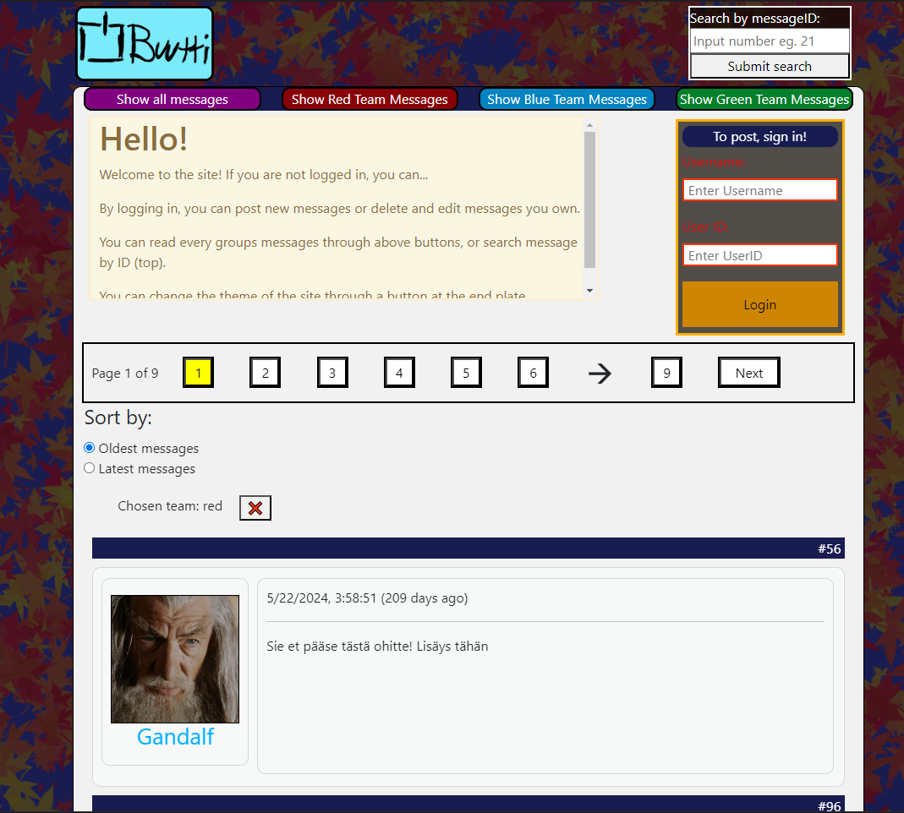

# Forum Frontend - A one week group project



## Description: 

Forum frontend project made in **one week** featuring a responsive design.

## Technologies

- HTML
- CSS
- JavaScript
- Forum API provided by Buutti
- Git

Originally, this project was held in a private repository. 328 commits were created - Git became very much familiar during the project. These commits are not sadly available in this public repository.

## Project structure
                                                     
```plaintext
forum frontend                                       
├── src/
|   .
|   .                   
│   ├── apiRequests.js    # API                                
│   ├── main.js           # main
│   └── theme.js          # theme file
|
├── img_pvkirja/
|   .
|   .
|   ├── roughDOM.png      # DOM structure 
.   └── scriptFlow.png    # file dependencies
.
├── package.json          # developer dependencies
├── paivakirja.md         # developer thoughts and notes from meetings (in Finnish)
├── README.md             # this file
└── userkeys.js           # user keys
``` 

## How to get started

1) Download the project to your computer
2) Open it with Visual Studio Code
3) Install the Live server extension
4) Right-click on index.html and select "Open with Live server".

## User instructions

All usernames are shared into three groups(red, green, blue). 

It is possible to view all messages or
just messages written by members of one group. Notice that by clicking a username in a message you can see all the messages written by that user. It is also possible to view individual messages by
inputting the id of the message into the input field in the upper right corner. You can see the id
of the message in the blue bar located above each message.

Normally you are allowed to sign in as a member of red team.
userKeys.js holds the userdata as this project did not enable us to use a Back End for logging in.
**For this repository, these keys are not provided.**
