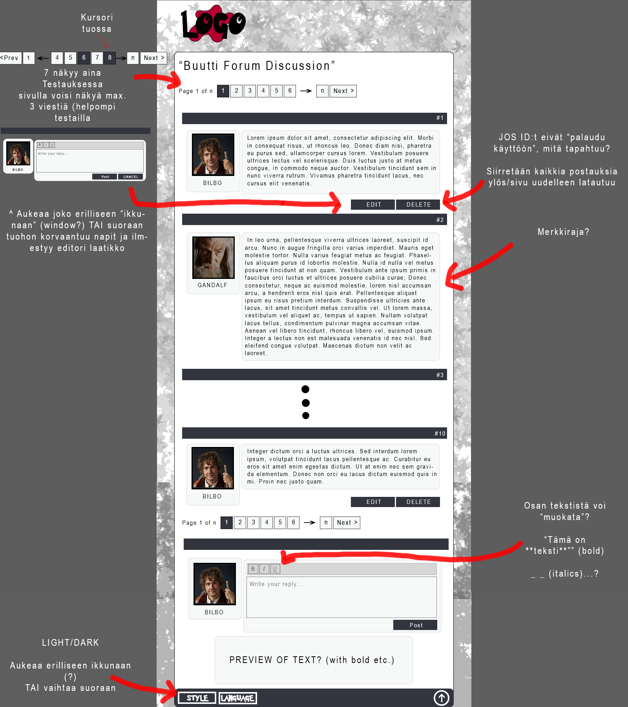
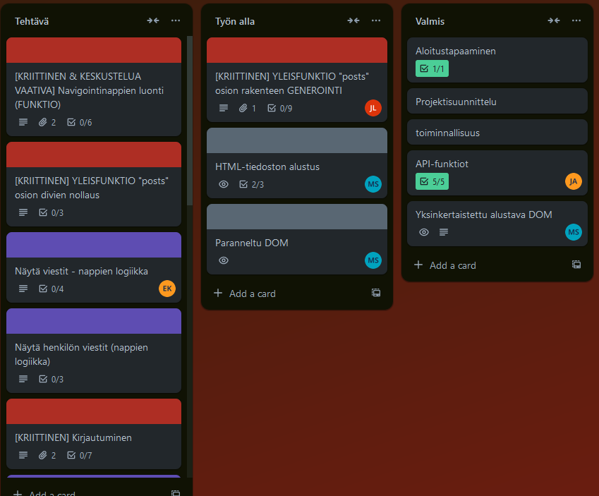
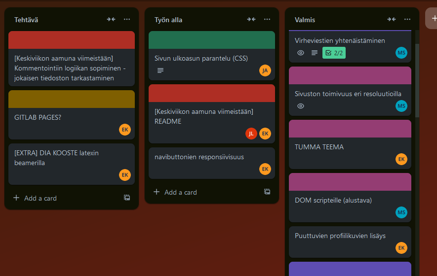

# Buutti foorumi projekti - muistiinpanoja

## PROJEKTIN TAVOITE

1) Chat/foorumi front end sivusto - luetaan YHDESTÄ lähteestä (ei useita eri palstoja) (**HTML**)
2) Visuaalisesti looginen järjestely (**CSS**)
3) Käyttäjän vuorovaikutus - Viestien Lisääminen/Muokkaaminen/Poistaminen sekä muu interaktio sivulla (**Javascript**)
4) *Ryhmätyöhön* orientoituminen

Tehtävässä ei sovelleta Frameworkkeja (React yms.)

## OMINAISUUDET

VAADITTUJA OMINAISUUKSIA:

Backendin funktiot käyttöön:

- Näytä kaikki viestit (allMessages) (paljonko liukumavaraa?)

- Näytä tietyn henkilön viestit (singleMessage/id)

- Lähetä uusi viesti (newMessage [header:userkey])

- Poista viesti (deleteMessage/id [header:userkey])

- Muokkaa viestiä (modifyMessage [header:userkey])

- **userkey -> Vaaditaan kirjautuminen(?)**

LISÄOMINAISUUDET:

- Responsiivisuus (CSS - Tietokone/puhelin)

- Teeman muuttaminen

- Sivustolla liikkuminen (takaisin ylös, useampaan sivuun jako...)

- Kieli(?)

## YLEISET ASIAT

Työaika:

    - 23.10.2024 09:00 - 30.10.2024

    - ~6h/päivä (36h)

    - KLO 9 ja 13 PALAVERIT - Muutenkin Discordissa

Tekijät (päärooli + ajatukset alussa):

- Erno Kauranen -- **Javascript**

        - Ohessa kertaa tarpeelliset asiat

- Jani Aalto -- **Yleinen teknisyys & Merge Master**

        - Tuttua kauraa!

- Jenni Laakso --  **Javascript**

        - Riittävä taso, mutta JOS tuodaan "evästeet" yms. mukaan, pääsee uuttakin oppimaan

- Miikka Siitonen -- **HTML + CSS**

        - "Miten yhtä aikaan voi samaa sukua olevia asioita edes säätää?"

Projektin etenemisen kirjaaminen:

    - TRELLO

    - Tämä päiväkirja

## PÄIVÄKIRJA

Kirjataan ylös päivän tapahtumat - pääosin Miikan näkökulmasta, ja sen mukaan, mitä kerkeää ihmisten ajatuksista kirjoittamaan palavereissa.

### 22.10.2024

- Sovittu työrooleista alustavasti, aikatauluista sekä kartoitettu alkutuntemukset

- Sovittu, että 23.10. aamupalaverissa käydään läpi **tarvittavat funktionaalisuudet** (*napit* noin sanotusti)

- Lisäksi keskustellaan visuaalisesta puolesta ALUSTAVASTI.

- Miikka tuotti prototyypin (kuvan) sivun rakenteesta. Osa MAHDOLLISISTA funktiosta uupuu, mutta hän päätti keskustella asiasta palaverissa 23.10.

---

### 23.10.2024

Miikka aloitti klo 04:00
    
    - Teki prototyypin nettisivusta (HTML, CSS)

    - Ongelmia on vielä - miten saa näyttämään hyvältä mobiililla, joidenkin osien (viestinumero) paddays ja marginaali ei toimi kuin pitäisi

    - Toiminallisuuksia EI ole

**AAMUPALAVERI 09:00:**

Miikan ideoita yön yli nukkumisen jälkeen:

    TARVITTAVIA ominaisuuksia: 

    YLEISIÄ (4 ryhmää + navigointi + Page Up):

    - Sivun ylälaidassa eri osat: `KAIKKI viestit`, `RED viestit`, `BLUE viestit` ja `GREEN viestit` nappeina!

    - Niitä painaessa, ajetaan: (allMessages) ehdoilla (kenen kaikkien viestit luetaan sivulle)

    - Navigointia:

        - JOS paljon viestejä, 10 viestiä/"lataus" - napeilla pääsee lukemaan lisää yms. (1, 2, 3, 4, 5 -> n)

        - Sivun alalaidasta takaisin ylös

--

    DATAN LUENNAN JÄLKEEN (4kpl):

    - Post-nappi (newMessage)

    - Poistonappi (VAIN omissa postauksissa) (deleteMessage)

    - Muokkausnappi (VAIN omissa postauksissa) (modifyMessage)

    - Tietyn henkilön viesteihin pääsee profiilinimestä

        - Tällöin EI VOI vuorovaikuttaa viestien kanssa

--

    EXTRA (2kpl):

    - Kieli (Suomi/Englanti)

    - Väriteema (Light/Dark)

ERNON ajatukset:

    - userID - ei voidä lisätä uusia!

JANIN ajatukset

    - -

JENNIN ajatukset:

    - Haku-palkki?

SOVITUT ASIAT:

    - ERNO -> API komentoja

    - JANI -> API komentoja

    - JENNI -> postausten generointi/visualisointi HTML sivulle (sekä navigointinapit, koska niin liitännäinen)

    - MIIKKA -> Yleinen HTML rakenteen tarkastelu sekä työvaiheiden erittely Trelloon

---

KESKUSTELU keskellä päivää:

- Työnjako haastavaa, ei tarpeeksi tekemistä jokaiselle

- Jotta X voi tehdä, tarvitaan Y... jota henkilö Z tekee...

- TRELLOA täytetty tehtävillä, mutta niiden väliset yhteydet epäselviä

    - Miikka alkoi tehdä puuta (DOM) näiden ajamana, että työn vaiheet visualisoituvat

Havaittu ongelma:

- Miten importataan HTML:n sisällä NPM:n scriptit -> Ratkaistiin kysymällä ohjaajalta

    ``

---
**KLO 13 palaveri (tapahtui klo 15:20)**

- JANI -> API komennot ovat valmiit ja tiedostossa

- MIIKKA -> HTML pohja on nyt generoitavia kohtia vaille 95% "valmis" (EXTRA hakupalkki + sivun alaosaan siirtymisen nappi puuttuvat). 

- JENNI -> Postausten visualisointi aloitettu, ja tämän hetken tilanne GitLabin pää-branchissa

- ERNO - KAIPAA vakavasti tekemistä, projektissa ei oikein riittänyt tänään hänelle

    - "Nopeat syövät hitaat" logiikkaa oli vähän ilmassa

    - Miikan mielestä oli ehkä virhe tehdä etukäteen pohjaa... MUTTA, pohjasta keskusteltiin, ja se hyväksyttiin kaikkien toimesta. EHKÄ kynnys vaatia uuden pohjan luomista ALUSTA oli liian korkea.

    - Miikan mielestä projekti ei olisi edennyt, jos konsensusta oltaisiin kysytty joka aiheesta

Huomisen agendana on JAKAA työtehtävät paremmin:

    - Jokaisella on ainakin YKSI nappi, mihin liitetään funktio (Erno ja Jani)

    - Puuttuvat staattiset napit lisätään (Miikka); CSS:n vikojen korjaaminen PROTOTYYPPIIN (ei projektiin vielä)

    - Jenni jatkaa viestien esittämiseen liittyvää työtä (välitulos Gitattu)

---

### 24.10.2024

Ennen aamupalaveria (yöllä)

- JENNI siisti viestien visualisoinnin koodia

- MIIKKA arvioi, kommentoi ja sääti siihen CSS:n toimimaan

- 23.10. luodut API komennot olivat perusfunktioita, ja testeissä piti muuttaa asynkronisiksi (await)

**AAMUPALAVERI 09:00:**

AGENDA:

- TRELLO

    - Täsmennetty eri taskit, mutta ne ELÄVÄT

    - ESIM. KRIITTISIKSI merkatut tehtävät ovat puolivalmiit ja epämääräiset vielä

    - Tehtävät ovat suoritettavassa järjestyksessä(?)

- TYÖN VAIHE ja KOODI REVIEW!

    - Merge Request käsittely (24.10. aamuun mennessä kertynyt)

    - Keskustellaan sisällöstä

        - pääscripti + API scripti ovat muuttuneet!

KIRJANPITOA:

    - Miikan mielestä työnjako on SELKEÄMPI, vaikka koodi muuttuikin IKÄVÄSTI aika paljon yöllä

    - Mutta näin se on, kun yhdelle hengelle annettiin aika iso projekti (HTML koodin generointi JS:n avulla)

**PÄIVÄN AGENDA**

ERNON ja JENNIN ajatukset sekä tehtävät päivälle:

    - JENNI & ERNO tekevät kolmea kriittistä osaa

    - Viestien luenta sivulle automaattisesti sivun ensi latauksella

    - Viestien tyhjennys sivulta, kun uutta dataa tahdotaan lukea - sisällä ^ vai erillinen funktio?

    - Navigointinappien generointi (+ toiminta?)

JANIN ja  ajatukset ja tehtävät päivälle:

    - Käyttäjän validointi - oikeus muokata/postata/deletoida

    - AJATUKSIA -> Miten voi työskennellä, jos kamaa tulee aamusin sairaasti

    - Aikaa menee koodin tulkkaamiseen, että uudet tehtävät voi aloittaa

    - Log in ei ole kriittistä - yksinkertaistetaan!

    - Ei voida ohjelmassa nähdä muita ryhmiä, joten sekin osa mietittävä tarkasti

MIIKAN ajatukset ja tehtävät päivälle:

    - DOM uudestaan?

    - Nappien logiikkaa(?)

    - CSS prototyypin säätöä, jos ei palaveroida loputtomasti
---

**PÄIVÄPALAVERI 13:00**

- AJATUKSIA

    - JENNI ja ERNO jatkaa navigointinappeja, aineiston esittelyn logiikkaa (ja poistoa)

        - Navi buttonit vähän vaiheessa vielä, mutta edistyneet

        - Välimergaus tehty

- JANI aloittaa uuden viestin lisäämisen logiikan kirjoittamista

    - MIIKKA lisäsi HTML pätkän, mistä funktio ajetaan

---

### 25.10.2024

**AAMUPALAVERI 09:00:**

- AJATUKSIA & SUUNNITELMIA

ERNO

    - Edeltävänä iltana oli mergessä ongelmia, mutta laitettu kuitenkin

    - Heitti Merge Requestin -> katsottiin se läpi ja conflictit korjattu!

    - Haluaa kokeilla erilaisia työtapoja - "katsotaan yhdessä tiettyä koodia -> erkaannutaan" yms.

JANI

    - Tarkisti ^ Mergauksen

    -  Uuden viestin lisäämisen logiikka käynnissä - auki vielä, miten sivu uudelleen ladataan

    - "main.js" siirretään osa koodista uuteen tiedostoon

    - MUISTAKAA mergata usein, jotta merget on pieniä!

    - (Ja tietenkin pullata aktiivisesti)

JENNI

    - Saamassa valmiiksi navigointinapit

    - Alkaa keskittyä vielä viestien generointiin/sivun uudelleen lataamiseen

    - EXTRA - Ryhmien filtteröinti, että näytetään vain tietyn setin viestit

MIIKKA

    - Keskusteltiin, miten yksittäinen viesti esitetään

    - Single viestin hakuun, hakupalkki, mihin syötetään viestin ID

    - API:lla kutsuttaan sitten viesti erilliseen ikkunaan

**PÄIVÄPALAVERI 13:00**

AGENDA loppupäiväksi:

 JENNI

    - Yleisfunktio kutsu on "valmis"!!! Voidaan kutsua muualtakin(?)

    - Ulkonäölliset asiat viestin esitykseen seuraavaksi

 ERNO

    - Pilkkoo main.js - yli 200 riviä koodia!!!

 JANI

    - Viestin muokkauksen funktionaalisuus jatkuu

    - Pushaa mainiin uusinta

    - Vinkki -> Pidä DEV tool auki aina

MIIKKA

    - Tuotetun koodin review

    - searchBariin pääfunktion kutsun osa (yhden viestin kutsu)

        - Tällä hetkellä manuaalisesti kopioitu ja editoitu

    - Yhden henkilön kaikkien viestien näyttöön funktiota eteenpäin

 
### 28.10.2024

**AAMUPALAVERI 09:00:**

Viikonlopun (perjantai illan) aikana Erno, Jenni ja Miikka teki hiukan asioita

ERNO

    - Ajatus: Kommentointia funktioihin(?) JS-Doc formaatti yms.

    - JOS jää aikaa, käydään läpi ^

    - main.js pilkkomisen tehty - käydään läpi sen tulos, kun saadaan mergattua

    - EDIT ja DELETE napit eivät enää toimi, joten niiden importtaus katsotaan vielä

JANI

    - PARANNETTAVAA:

    - Kun hakee yhtä viestiä tulee virheviesti. Se ei katoa!

    - Yhtenäistetään, yksi viestitystoiminto - nyt on alert ja suora HTML inject

    - Alsutavasti: Window.alert on yhtenäistyksen tavoite

    - Toinen asia: Viestien järjestys muuttuu jännästi (vanhat ensiksi, uudet ensiksi... vaatii vielä ajatusta) -> Nappi tämän valintaan

    - Kun käyttäjä lähettää uuden viestin/muokkaa, sivu scrollaa viestin luo (vikalle sivulle, viimeisimpään viestiin)

JENNI

    - Sai valmiiksi:

    - Sisällöt (ajat mm.) menee nätiksi

    - Yleiseen funktioon tulee tietyn käyttäjän viestit - prototyypitetty

    - Filtteri mahdollistaa, että näyttää uusimmat viestit - aiemmin meni aina ensimmäiselle sivulle

    - Aloittaa Janin 2. ehdotuksen työstämisen

    - VOISI tehdä: Käyttäjälle näytetään, mikä sivu hänellä on auki, ja tämä voi palata "kaikkiin viesteihin" raksista.

MIIKKA

    - Ilmoitti, että on 28.10. ja 29.10. poissa hiukan (siskon vierailu). Kumpanakin päivänä ehkä 30min poissa lounaan päälle. (29.10. klo 14 maissa)

    - Jos jää extra-extra aikaa, voisi tehdä script-DOM tiedoston -> Miten scriptit kommunikoivat keskenään

    - Ernon kanssa käydään läpi main.js sisältö ja sen sisältämiä kutsuja

**PÄIVÄPALAVERI 13:00:**

ERNO

    - Jatketaan koodin läpikäyntiä ja arviointia - onko siellä isoja vikoja vielä

    - Rivi-riviltä analyysia, kommentointia tai nimien vaihtoa

    - buttons.js joka sisältää anvigointi nappien luonti

JANI

    - Koodin siivousta

    - Yksinkertaistetaan, ettei tarvii painaa radio napin jälkeen "ajo" -> Pelkkä radio

    - LUETTAVUUS! Ei laiteta yhdelle riville IF-lauseita + formatointia

    - Edit message nappia painettaessa laatikkoon tulee nyt vähän liikaakin... muutetaan, että vain viestiä editoidaan

JENNI

    - Yhden henkilön viestien järjestely koodi on edennyt

    - Vielä auki, miten saa niin, että tietyn ryhmän sisällä painellessa ei jouduta ekalle sivulle (?)

    - Ajatus: Awaitit oikeisiin paikkoihin(?), jos uupuu vielä

    - Ajatus: Kun painetaan viestien järjestyksen muuttoa, minne sivu palautuu? Sivun alkuun, vai tiettyyn viestiin

MIIKKA

    - Aloitti vähän jo tekemään scriptien "DOM tiedostoa"

KLO 15:30 juttelu

- Lisäiltiin trelloon viimesilauksia vaativat tehtävät

- Vähän keskiviikon esityksestä - ei aleta tekemään ylilyötyä diaesitystä

### 29.10.2024

**AAMUPALAVERI 09:00:**

ERNO

    - Pari tuntia teeman muutoksen käsittelyä + kuvat

JANI

    - Sivun indeksin säilytys, kun poistetaan ja muokataan

JENNI

    - Eilisen hommat mergaukseen, kun on eka pullattu muutokset (muutettava asioita)

MIIKKA

    - Virheviestien yhtenäistäminen alkaa

**PÄIVÄPALAVERI 13:00:**

ERNO

    - README.md tuotto

JANI

    - Login/logout logiikkaa

JENNI

    - README tuotto

MIIKKA

    - Jatkaa vielä CSS ja bootstrap, mutta jakaa vastuuta, kun tarve tulee

    - Erno otti navigointi napit, Jenni message laatikot

### 30.10.2024 (FINAL DAY)

**AAMUPALAVERI 09:00:**

Trellon tilanne aamulla

ERNO

    - Navinappi

    - Demonstraation diat

JANI

    - Koodin formatointi ja kommentointi

JENNI

    - README.md kirjoitusta

MIIKKA

    - DOM kuva, sekä scriptien välinen rakenne kuvan muodossa lisätty (päiväkirjan kuvien kansiossa)

    - Navinappi

**MINIPALAVERI 10:45**

Sovittiin DEMO:n vaiheista ja rooleista

ERNO

    - Projektin alku, työnjako ja suunnittelu

JANI

    - Tekninen puoli, Git(?), rakenteet tiedostoilla(?)

JENNI

    - Virallinen Demo osuus - näytetään sivua

MIIKKA

    - Vastaa asioihin, mitä aiemmat ^ eivät käsitä (esim. mitä tekisimme toisin)

**PÄIVÄPALAVERI 13:00:**

Ei koettu tarpeelliseksi enään keskustella

ERNO

    - 

JANI

    - 

JENNI

    - 

MIIKKA

    - 
